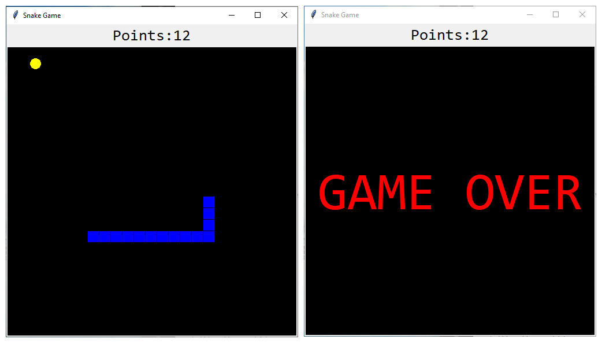

# Python Snake

The classic snake game made in [Python Tkinter](https://docs.python.org/3/library/tkinter.html). Written for Python3 by [GeeksforGeeks](https://www.geeksforgeeks.org/snake-game-in-python-using-pygame-module/). Licensed under the [MIT License](https://choosealicense.com/licenses/mit/).

<div align="center">


Simple Snake Game
</div>

## Basic Instructions

Use the arrow keys to move: the left arrow key to move left, the right arrow key to move right, the up arrow key to move up, and the down arrow key to move down.

## How to play

- Clone the repository:

```
$ git clone https://github.com/rajeshpolipalli
```

- Install Python:

Make sure Python is installed on your system. You can download it from the official [Python website](https://www.python.org/).

- Open the project in Visual Studio Code:

Open Visual Studio Code and click on "File" -> "Open Folder...".
Select the folder where you cloned your repository.

- Run ```game.py```:


- Play the game:

Once the game is running, follow the instructions to play the Snake Game. Typically, you'll use arrow keys to control the snake.

## About the Game
<div align='center'>
<h4> <span> · </span>  <span> · </span> <a href="https://github.com/rajeshpolipalli"> Report Bug </a> <span> · </span> <a href="https://github.com/rajeshpolipalli"> Request Feature </a> </h4>
</div>

## if any quaries please contact us
Github:https://github.com/rajeshpolipalli
E mail:polipallirajesh10@gmail.com